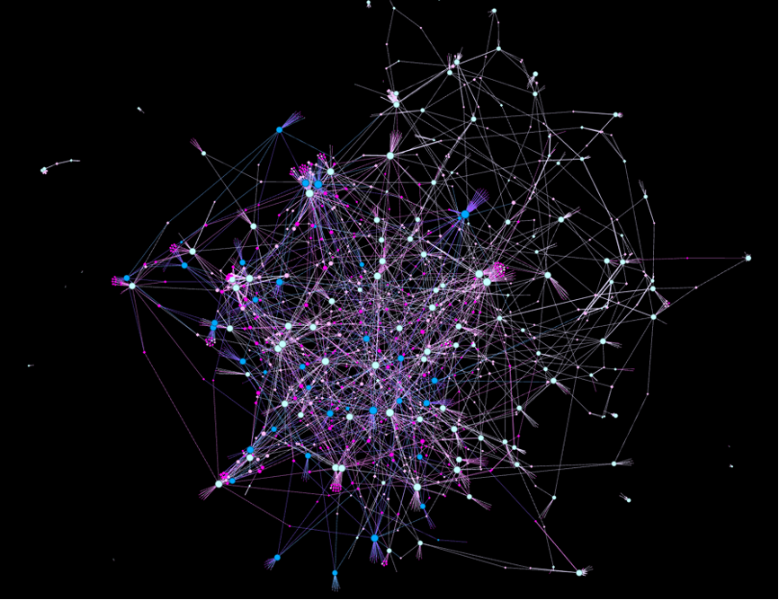

### Analysis of Collaboration Networks and Heat Prediction Based on Director-Actor Cooperation in Chinese Web Dramas

##### Constructing a Dual-mode Network of Director-Actor Collaboration in Chinese Web Dramas

##### Network Analysis

1. Different characteristics between actors and directors in the network are identified and explained.
2. The top 10 actors and directors, crucial for the development of Chinese web dramas, are highlighted based on their degree centrality.
3. A community division based on frequent collaborations among directors and actors reveals the presence of a malignant group, providing insights for industry supervision and regulation.
4. Network block density analysis based on the nature of TV drama appearances indicates assortativity in the network, with resources becoming more concentrated as the industry develops.

##### Heat Prediction

Multiple linear regression analysis identifies various factors influencing the popularity of web dramas. Apart from the impact of the drama itself and the platform, the degree centrality of actors and directors, as well as the director's constraint coefficient, show a strong correlation with popularity.

Furthermore, a random forest machine learning model is employed to predict popularity and classify "explosive dramas". Comparison of experimental results with and without network characteristics demonstrates that analyzing network features significantly improves the performance of the model. Both models perform well, especially the "explosive drama" classification prediction model, which has strong practical value. It can predict whether a web drama will become a hit based on basic information before production, serving production companies and other stakeholders.